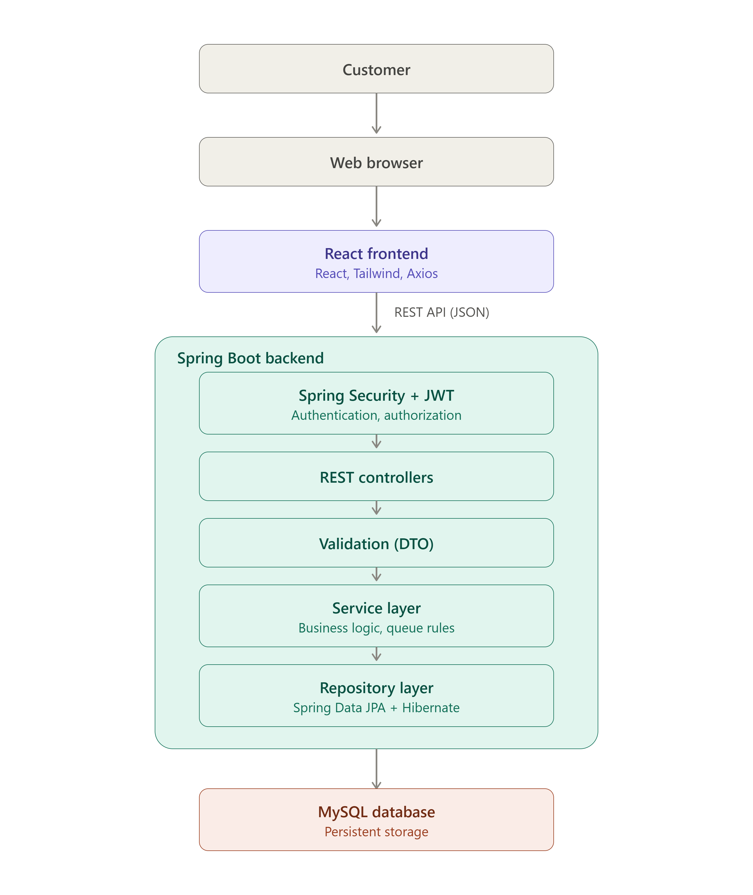

# 🚀 QueueFlow

## Introduction

**QueueFlow** is a Smart Queue & Token Management System designed to replace traditional manual queue systems with a modern digital solution. It helps organizations efficiently manage customer queues, reduce waiting times, and improve the overall service experience.

## 📌 Problem Statement

Many organizations such as hospitals, banks, government offices, and service centers still rely on manual token systems or physical queues. These methods often lead to long waiting times, poor queue visibility, inefficient counter management, and a frustrating customer experience.

QueueFlow aims to solve these problems by providing a digital queue management system that allows customers to generate tokens, monitor live queue status, estimate waiting time, and enables administrators to efficiently manage queue operations.

## ✨ Features

- 🔐 Secure User Authentication
- 👥 Role-Based Access Control (Admin, Operator, Customer)
- 🎫 Digital Token Generation
- 📋 Live Queue Tracking
- ⏱️ Estimated Waiting Time
- 🏢 Counter Management
- 📊 Dashboard & Analytics
- 📄 Report Generation
- 📱 Responsive Web Application

## 🛠️ Technology Stack

### Backend

- Java 21
- Spring Boot
- Spring Security
- Spring Data JPA
- Hibernate
- MySQL
- Maven

### Frontend

- React.js
- Tailwind CSS
- Axios
- React Router

### Tools

- Git & GitHub
- Postman
- Swagger
- IntelliJ IDEA / VS Code

## Project Architecture

## Future Scope

QR Code Token Generation
SMS Notifications
WhatsApp Alerts
Email Notifications
AI Waiting Time Prediction
Voice Announcement
Mobile App

## 🚧 Project Status

This project is currently under active development.
