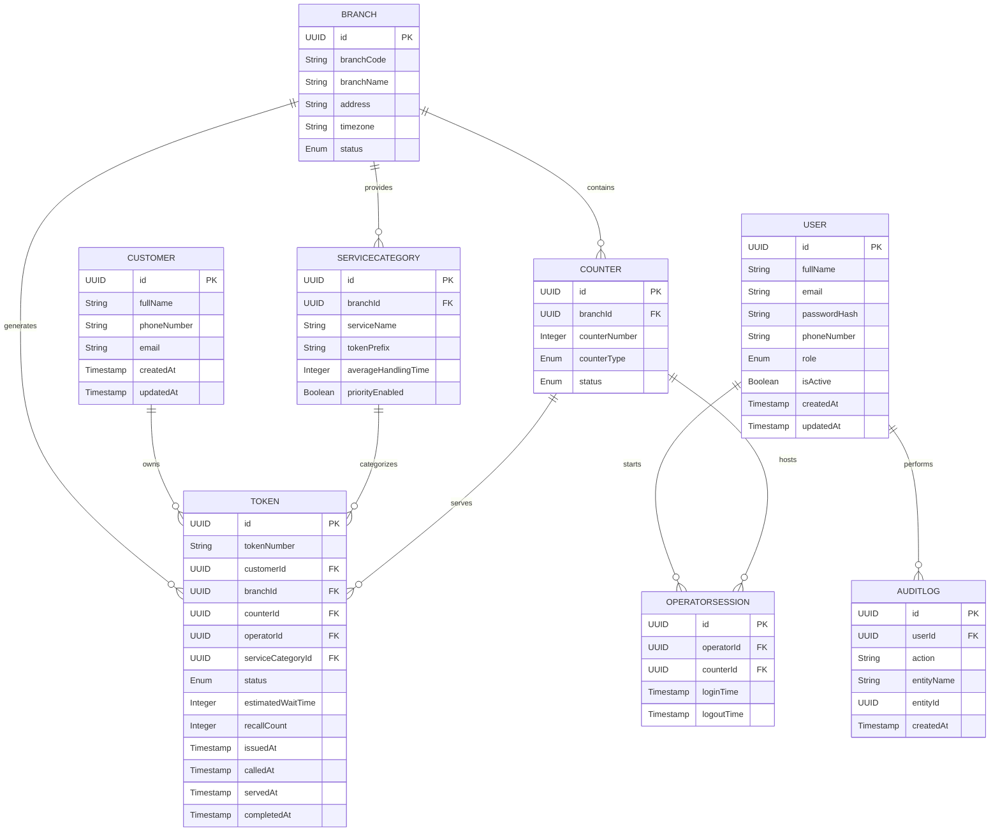

# QueueFlow - Entity Relationship Diagram (ERD)

**Project:** QueueFlow – Smart Queue & Token Management System

**Version:** 1.0

**Document Type:** Entity Relationship Diagram Specification

**Status:** Approved

---

# 1. Introduction

The Entity Relationship Diagram (ERD) defines the logical relationships between the entities in the QueueFlow database.

It acts as the blueprint for implementing Hibernate Entity Relationships using Spring Data JPA.

This document helps developers understand:

- How entities are connected
- Relationship cardinality
- Foreign Key references
- Database navigation
- Future scalability

---

# 2. Design Principles

The ER Diagram follows these principles:

- Database Normalization (3NF)
- Referential Integrity
- Minimal Data Redundancy
- High Cohesion
- Low Coupling
- Easy Scalability

---

# 3. Core Entities

The Version 1 database contains the following entities.

- User
- Customer
- Branch
- Counter
- ServiceCategory
- Token
- OperatorSession
- AuditLog

---

# 4. Entity Relationship Diagram (Mermaid)

---

# 5. Relationship Summary

| Parent | Child | Relationship |
|----------|---------|--------------|
| Branch | Counter | One-to-Many |
| Branch | ServiceCategory | One-to-Many |
| Branch | Token | One-to-Many |
| Customer | Token | One-to-Many |
| ServiceCategory | Token | One-to-Many |
| Counter | Token | One-to-Many |
| User | OperatorSession | One-to-Many |
| Counter | OperatorSession | One-to-Many |
| User | AuditLog | One-to-Many |

---

# 6. Relationship Explanation

## Branch → Counter

One branch can contain multiple service counters.

Every counter belongs to exactly one branch.

---

## Branch → ServiceCategory

Each branch can offer multiple services.

Each service belongs to one branch.

---

## Branch → Token

Every generated token belongs to the branch where it was issued.

---

## Customer → Token

A customer can generate multiple tokens over time.

Business rules ensure that only one active token exists per customer within a branch.

---

## ServiceCategory → Token

Every token is associated with exactly one service.

One service category can have thousands of tokens.

---

## Counter → Token

One counter serves many customers.

Each completed token stores the counter responsible for processing it.

---

## User → OperatorSession

Operators can log in multiple times.

Each login creates a new session.

---

## Counter → OperatorSession

One counter can host many sessions over time.

Only one active session is allowed at a given moment.

---

## User → AuditLog

Every administrative action performed by a user is permanently recorded.

---

# 7. Cardinality

| Relationship | Cardinality |
|--------------|-------------|
| Branch → Counter | 1 : N |
| Branch → ServiceCategory | 1 : N |
| Branch → Token | 1 : N |
| Customer → Token | 1 : N |
| ServiceCategory → Token | 1 : N |
| Counter → Token | 1 : N |
| User → OperatorSession | 1 : N |
| Counter → OperatorSession | 1 : N |
| User → AuditLog | 1 : N |

---

# 8. Referential Integrity Rules

The following constraints maintain database consistency.

- A Counter cannot exist without a Branch.
- A ServiceCategory cannot exist without a Branch.
- A Token cannot exist without a Customer.
- A Token cannot exist without a ServiceCategory.
- An OperatorSession cannot exist without both a User and a Counter.
- An AuditLog cannot exist without a User.

---

# 9. Cascade Strategy

The following cascade strategy is recommended for Hibernate.

| Relationship | Cascade Recommendation |
|--------------|-----------------------|
| Branch → Counter | CascadeType.ALL |
| Branch → ServiceCategory | CascadeType.ALL |
| Branch → Token | No Cascade |
| Customer → Token | No Cascade |
| User → OperatorSession | CascadeType.ALL |
| Counter → OperatorSession | CascadeType.ALL |
| User → AuditLog | CascadeType.PERSIST |

---

# 10. Fetch Strategy

| Relationship | Fetch Type |
|--------------|------------|
| ManyToOne | LAZY |
| OneToMany | LAZY |
| OneToOne (Future) | EAGER (if required) |

LAZY loading is recommended to improve application performance and reduce unnecessary database queries.

---

# 11. JPA Mapping Preview

The following annotations will be used during backend implementation.

- @Entity
- @Table
- @Id
- @GeneratedValue
- @Column
- @ManyToOne
- @OneToMany
- @JoinColumn
- @Enumerated
- @CreationTimestamp
- @UpdateTimestamp

---

# 12. Future Relationships

Future versions may introduce:

- Notification → Customer
- RefreshToken → User
- Feedback → Token
- DisplayScreen → Branch
- Announcement → Branch

These additions will not require restructuring the current database.

---

# 13. Conclusion

The QueueFlow ER Diagram provides the structural blueprint for implementing the database using Spring Boot, Hibernate ORM, and MySQL.

All entity relationships have been designed to ensure scalability, maintainability, referential integrity, and efficient query performance while supporting future feature expansion.